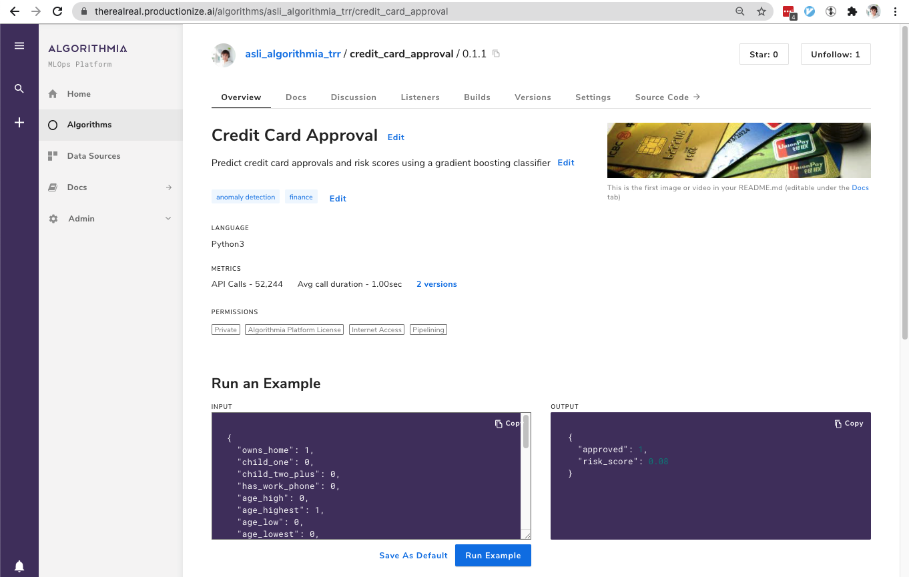
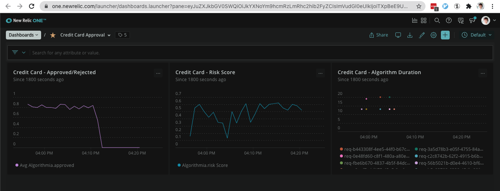

# Algorithmia-New Relic - Temp space for colab work
Contains a simple load generation script for an algorithm on Algorithmia that streams its metrics to New Relic Account #3019600

## Story
Our user on Algorithmia has a Credit Card Approval algorithm. This algorithm is processing a user's demographic information as its input, and using an ML model to predict whether this credit card application should be approved or rejected. As its response, it returns a 1/0 value for approved/rejected, and this decision's `risk_score` as a probability between 0 and 1.



In order to detect anomalies in their model behavior, our algorithm owner wants to stream their metrics over Algorithmia Insights to New Relic. If their model suddenly (incorrectly) classifies a large percentage of applicants as high risk and denies their credit card applications, then they would like to be notified of this situation through New Relic's alerting features.

Our algorithm owner would also like to observe their model's operational metrics, such as the runtime duration of the algorithm, to keep an eye on their response times. 

## Input data

`data` folder contains a set of 25K records:
- `all.csv`: 25k records, as a mix of applications to be approved+rejected
- `reject.csv`: 5k records of applications to be rejected
- `approve.csv`: 20k records of applications to be approved


## Observed Algorithm output
The algorithm's streamed metrics are observed on this account's Credit Card Approval Dashboard as below:


Streamed data structure is as follows:
```json
[
  {
    "name": "algorithmia.approved",
    "timestamp": 1613707378916,
    "value": 1,
    "type": "gauge",
    "attributes": {
      "algorithm_name": "credit_card_approval",
      "algorithm_version": "0.1.1",
      "algorithm_owner": "asli_algorithmia_trr",
      "request_id": "req-04c88db3-a0c1-4123-aaa1-6a096b59e4ec",
      "session_id": "rses-ec437101-e319-4123-8a4d-e65efdc86fd9"
    }
  },
  {
    "name": "algorithmia.risk_score",
    "timestamp": 1613707378916,
    "value": 0.43,
    "type": "gauge",
    "attributes": {
      "algorithm_name": "credit_card_approval",
      "algorithm_version": "0.1.1",
      "algorithm_owner": "asli_algorithmia_trr",
      "request_id": "req-04c88db3-a0c1-4123-aaa1-6a096b59e4ec",
      "session_id": "rses-ec437101-e319-4123-8a4d-e65efdc86fd9"
    }
  },
  {
    "name": "algorithmia.n_features",
    "timestamp": 1613707378916,
    "value": 29,
    "type": "gauge",
    "attributes": {
      "algorithm_name": "credit_card_approval",
      "algorithm_version": "0.1.1",
      "algorithm_owner": "asli_algorithmia_trr",
      "request_id": "req-04c88db3-a0c1-4123-aaa1-6a096b59e4ec",
      "session_id": "rses-ec437101-e319-4123-8a4d-e65efdc86fd9"
    }
  },
  {
    "name": "algorithmia.duration_milliseconds",
    "timestamp": 1613707378916,
    "value": 8,
    "type": "gauge",
    "attributes": {
      "algorithm_name": "kafka_insights_producer",
      "algorithm_version": "0.1.1",
      "algorithm_owner": "asli_algorithmia_trr",
      "request_id": "req-04c88db3-a0c1-4123-aaa1-6a096b59e4ec",
      "session_id": "rses-ec437101-e319-4123-8a4d-e65efdc86fd9"
    }
  }
]
```

## How to generate load
To simulate "usual times", run `python3 load.py all`
This will send a mix set of credit card applications that will be approved or rejected.

To simulate "unusual times", run `python3 load.py reject`
This will only send credit card application requests that the algorithm will reject.

To normalize the stats, run `python3 load.py approve`
This will only send credit card application requests that the algorithm will approve.


## Requirements
- algorithmia --> `pip install algorithmia`
- pandas